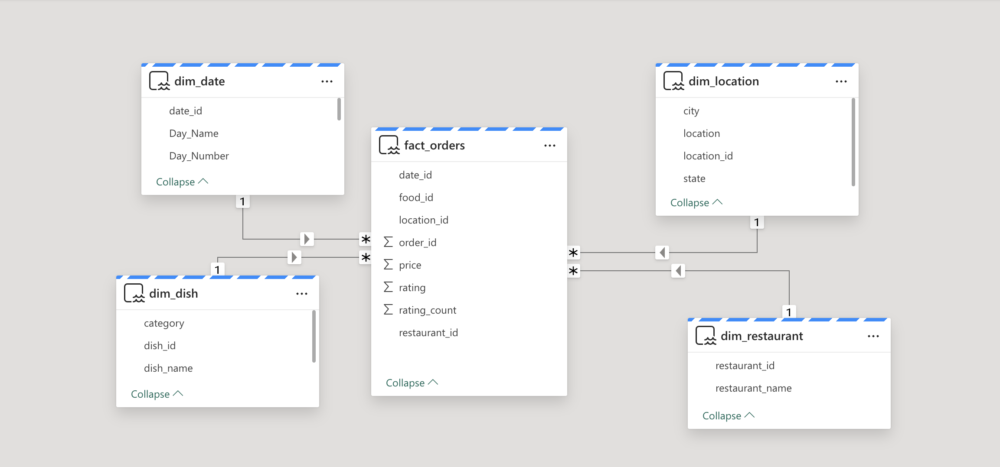
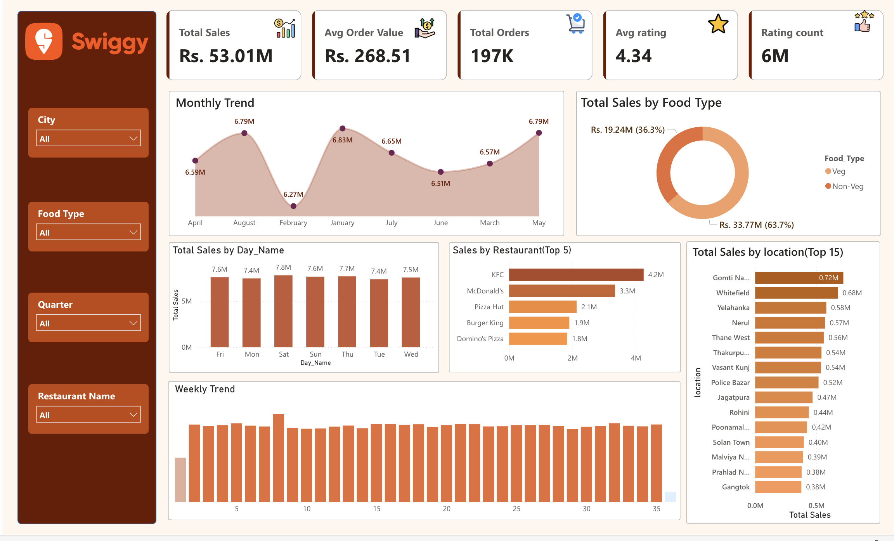
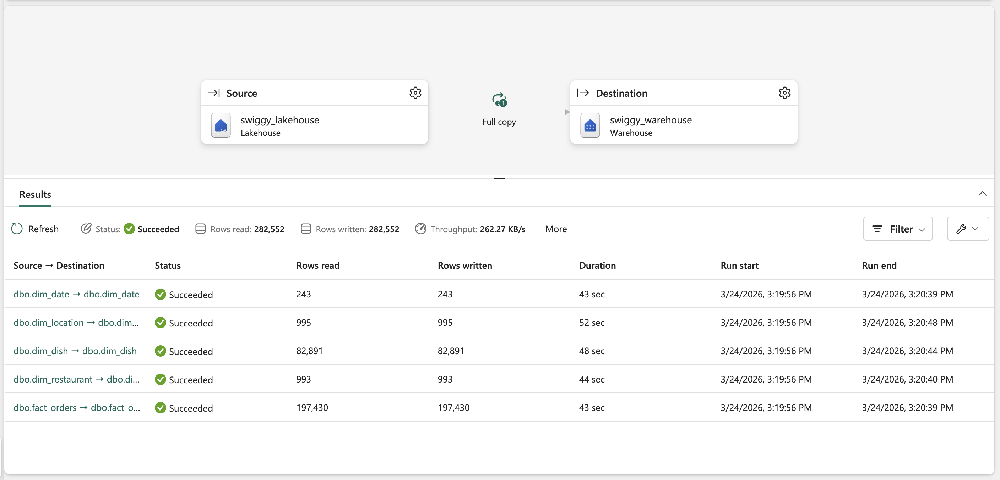
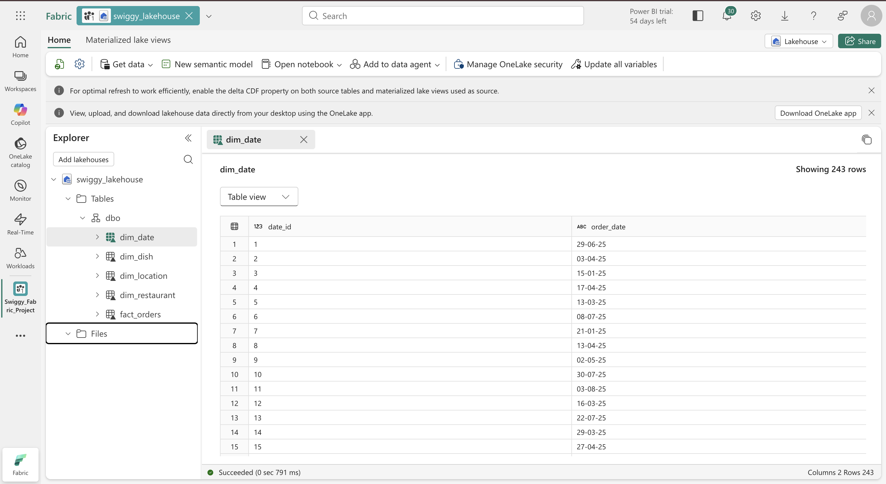

# 🍽️ Swiggy End-to-End Data Pipeline using Microsoft Fabric

---

## 📌 Project Overview
This project demonstrates a complete **end-to-end data engineering pipeline** built using **Microsoft Fabric**.  
It covers data ingestion, transformation, modeling, and visualization to generate meaningful business insights from Swiggy datasets.

---

## 🎯 Objectives
- Build a scalable data pipeline using Microsoft Fabric  
- Perform data cleaning and transformation  
- Design a structured data model (Star Schema)  
- Enable analytics using Warehouse  
- Create interactive dashboards using Power BI  

---

## 🛠️ Technologies Used
- Microsoft Fabric (Lakehouse, Warehouse, Pipeline)  
- SQL  
- Power BI  
- CSV Data Sources  

---

## 🏗️ Architecture
Raw Data → Lakehouse → Transformation → Warehouse → Power BI Dashboard  

---

---

## 📂 Dataset
The project uses multiple structured datasets:

- 📄 fact_orders.csv  
- 📄 dim_restaurant.csv  
- 📄 dim_location.csv  
- 📄 dim_dish.csv  
- 📄 dim_date.csv  

---

## ⚙️ Implementation Steps

### 🔹 1. Data Ingestion (Lakehouse)
- Uploaded raw CSV files into Fabric Lakehouse  
- Converted raw data into structured tables  

---

### 🔹 2. Data Transformation
- Cleaned and transformed data using SQL  
- Handled missing values  
- Standardized data formats  

---

### 🔹 3. Data Modeling (Warehouse)
- Created fact and dimension tables  
- Implemented **Star Schema**  
- Established relationships between tables  

---

### 🔹 4. Data Pipeline (Automation)
- Built a **pipeline in Microsoft Fabric**  
- Copied data from Lakehouse → Warehouse  
- Enabled automated data flow  

---

### 🔹 5. Data Visualization (Power BI)
Created an interactive dashboard showing:
- 📊 Total Sales  
- 📈 Monthly Trends  
- ⭐ Average Rating  
- 🍽️ Top Restaurants  
- 📍 Location-wise Sales  

---

## 🧾 SQL Queries

The project includes SQL queries used for:

- data validation
- row count checks
- date transformation
- feature engineering
- food type classification
- time-based analysis

📂 File: `swiggy_queries.sql`

---

## 🔗 Data Model (Relationships)

👉 Star schema with:
- `fact_orders` as Fact table  
- Dimension tables: date, dish, location, restaurant  

---

## 📊 Dashboard Preview

---

## ⚙️ Pipeline Execution

---

## 🏢 Lakehouse Setup

---

## 📊 Key Insights
- Identified top-performing restaurants  
- Analyzed sales trends across cities  
- Discovered ordering patterns and peak periods  
- Compared Veg vs Non-Veg sales distribution  

---

## 👩‍💻 Author
**Vibha Pateshwari**  
🔗 GitHub: https://github.com/VibhaCodes  

---

⭐ *This project demonstrates a modern data engineering workflow using Microsoft Fabric, combining ETL, data modeling, and business intelligence.*

